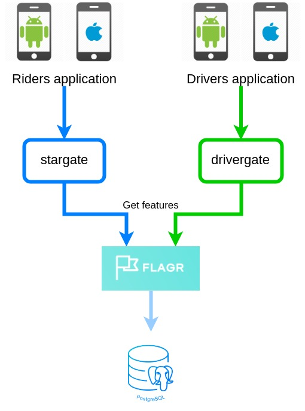
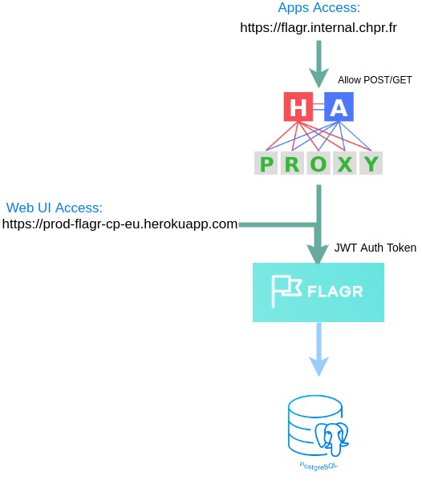

# Using Flagr at Chauffeur Prive

Here is a quick overview of how we use Flagr at Chauffeur Prive. It is a great asset for the expansion 
as you can easily activate/deactivate features based on the user's location.

If not done yet, have a look at [Flagr overview](./flagr_overview.md)



## Security

Flagr web UI is accessible by default without any integrated security (no ACL, RBAC or authentication). Since the micro service is deployed on Heroku,
it is therefore public, meaning anybody can edit/add/delete flagr configuration. 

The "official" DNS name to access Chauffeur Prive's Flagr is https://flagr.internal.chpr.fr. This URL is used by
the other micro services, and goes through HAProxy. To control the apps actions on Flagr, the access through 
HAProxy is limited to `GET` and `POST` requests.

Extract from HAProxy configuration file:
```
# Allow accessing flagr only with GET and POST requests
use_backend flagr if is_flagr METH_GET METH_POST
```

On top of that, we implemented the only security measure offered by Flagr: JWT (see [Flagr environment variables](./flagr_env.md)).
Every micro service wanting to access Flagr will need an JWT auth token. This is done by setting two environment
variables in `stargate` and `drivergate`:

```yaml
FLAGR_API_URL: 'https://flagr.internal.chpr.fr'
FLAGR_AUTH_TOKEN: '.....'
```



### Access to Flagr web UI

As shown previously on Flagr security architecture, the full web ui access is only accessible by using the
heroku DNS name `https://prod-flagr-cp-eu.herokuapp.com` with the correct JWT token. You will have to add the
following header:
> `Authorization: Bearer myJWTToken`

The JWT tokens can be found in 1password (`Flagr Production` and `Flagr staging`).
